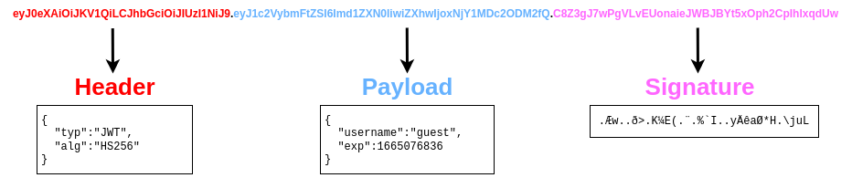

# 完全初学者
### Google Dorking
- 常用关键搜索术语
  - **site** 指定网站
  - **filetype** 指定文件类型
    - - `site:bbc.co.uk filetype:pdf`
  - **catch** 指定缓存
  - **intitle** 标题包含
    - `intital:index.of`

### [Linux 基础](https://github.com/MasterandRoot/Learn-THM/blob/main/Pre%20Security/Linux%E5%9F%BA%E7%A1%80.md)

### 网络黑客基础知识
##### [Burp Suite]()
##### OWASP Top 10 - 2021
1. 访问控制破坏
  - 访问控制破坏允许攻击者绕过授权，从而允许他们查看敏感数据或执行他们不应该执行的任务。
  - [辅助阅读](https://bugs.xdavidhu.me/google/2021/01/11/stealing-your-private-videos-one-frame-at-a-time/)
  - [不安全的直接对象引用](https://github.com/MasterandRoot/Learn-THM/blob/main/Jr%20Penetration%20Tester/Jr%20Penetration%20Tester.md#idor)
2. 加密失败( Cryptographic Failures)
  - 传输加密
    - 中间人攻击弱加密
  - 静态数据加密
    - 数据库失密(SQLite)
3. 注入
  - [命令注入](https://github.com/MasterandRoot/Learn-THM/blob/main/Jr%20Penetration%20Tester/Jr%20Penetration%20Tester.md#command-injection%E5%91%BD%E4%BB%A4%E6%B3%A8%E5%85%A5)
    - 又称远程代码执行
      - `uname -a`
      - `cat /proc/version`
  - [SQL注入](https://github.com/MasterandRoot/Learn-THM/blob/main/Jr%20Penetration%20Tester/Jr%20Penetration%20Tester.md#sql%E6%B3%A8%E5%85%A5)
4. 不安全设计(Insecure Design)
  - 不安全的密码重置
    - 不久前 Instagram上就出现了此类漏洞的一个很好的例子。Instagram 允许用户通过短信向他们的手机号码发送 6 位代码进行验证，从而重置忘记的密码。如果攻击者想要访问受害者的帐户，他可以尝试暴力破解 6 位代码。正如预期的那样，这不可能直接实现，因为 Instagram 实施了速率限制，因此在 250 次尝试后，用户将被阻止进一步尝试
    - 然而，攻击者发现速率限制仅适用于来自同一 IP 的代码尝试。如果攻击者有多个不同的 IP 地址来发送请求，他可以为每个 IP 尝试 250 个代码。对于 6 位代码，有一百万个可能的代码，因此攻击者需要 1000000/250 = 4000 个 IP 才能覆盖所有可能的代码。 这听起来似乎需要拥有大量的 IP，但云服务可以轻松地以相对较小的成本获取这些 IP，从而使这种攻击变得可行
      - 易猜测的密码重置问题
5. 安全配置错误(Security Misconfiguration)
  - 云服务（例如 S3 存储桶）的权限配置不当
  - 启用不必要的功能，例如服务、页面、帐户或权限
    -  例: Werkzeug 控制台开放调试接口
  - 密码未更改的默认帐户
  - 错误消息过于详细，允许攻击者找到有关系统的更多信息
  - 不使用 HTTP 安全标头
6. 易受攻击和过时的组件(Vulnerable and Outdated Components)
  - 漏洞利用
7. 身份验证失败
8. 软件和数据完整性故障(Software and Data Integrity Failures)
  - hash值
  - 软件完整性故障(Software Integrity Failures)
    - 现代浏览器允许您沿着库的 URL 指定哈希，以便仅当下载文件的哈希与预期值匹配时才执行库代码。这种安全机制称为子资源完整性 (SRI)
  
    ```javascript
    <script src="https://code.jquery.com/jquery-3.6.1.min.js" integrity="sha256-o88AwQnZB+VDvE9tvIXrMQaPlFFSUTR+nldQm1LuPXQ=" crossorigin="anonymous"></script>
    ```
    - 可以访问 https://www.srihash.org/ 为任何库生成哈希值
  - 数据完整性故障(Data Integrity Failures)
    - JWT 令牌
  
      

      - **Header** 包含指示这是 JWT 的元数据，并且使用的签名算法是 HS256
      - **Payload** 包含键值对以及 Web 应用程序希望客户端存储的数据
      - **Signature** 类似于哈希，用于验证有效负载的完整性
      - 如果更改 Payload，Web 应用程序可以验证签名是否与有效负载不匹配，并知道篡改了 JWT。与简单的哈希不同，此签名涉及仅使用服务器持有的密钥，这意味着如果更改有效负载，除非知道密钥，否则将无法生成匹配的签名
      - 令牌的 3 个部分中的每一个部分都是使用 Base64 编码的简单明文。可以使用工具对 Base64 进行编码/解码
    - JWT 令牌破解
      1. 修改令牌的标头部分，以便alg 标头包含 value none
      2. 删除签名部分
     
        
9. 安全日志记录和监控故障
10. [服务器端请求伪造（SSRF）](https://github.com/MasterandRoot/Learn-THM/blob/main/Jr%20Penetration%20Tester/Jr%20Penetration%20Tester.md#ssrf)

##### OWASP Juice Shop
  - 日后专题学习
##### 漏洞上传(Upload Vulnerabilities)
  - 学习重点
    - 覆盖服务器上的现有文件
    - 在服务器上上传并执行 Shell
    - 绕过客户端过滤
    - 绕过各种服务器端过滤
    - 欺骗内容类型验证检查
  - 覆盖现有文件
  - 远程代码执行(在服务器上上传并执行 Shell)
    - 使用 Gobuster 遍历网站目录，找到上传的文件所在的位置
    - 上传 payloads
    - 获得反向 shell
  - 过滤
    - 扩展名验证过滤
    - 文件类型过滤
      - MIME 验证
  
        
        
        - MIME 类型遵循格式 `<type>/<subtype> `
      - 幻数验证
    - 文件长度过滤
      - 在管理良好的系统上，我们上传的文件不太可能与我们在上传之前指定的名称相同
    - 文件名过滤
  - 基本步骤 — 挑战
    1. 检索网站。使用 Gobuster 遍历网站目录，发现 **/content** 、 **/admin** 等目录
    2. 找到上传文件位置。上传正常文件，使用 Gobuster 遍历，利用题目给出的字典，发现文件上传进 **/content** 目录下
       - `-x` 参数，规定后缀  例子: `-x jpg,php`
         - `gobuster dir -u http://jewel.uploadvulns.thm -w ./UploadVulnsWordlist.txt -x jpg`
    3. 查验客户端过滤。发现 **upload.js**对上传文件进行客户端过滤，过滤文件大小、文件后缀、文件幻数。使用burpsuite拦截修改该文件
    4. 查验服务端过滤。通过更改后缀名上传、更改幻数上传、更改MIME类型上传，发现使用MIME类型过滤，使用burpsuite拦截修改后上传
    5. 上传反向shell。经wappalyzer发现网页使用node.js，上传 node.js 的反向shell

### 密码学
##### John the Ripper 
  - John the Ripper 是最著名、最受欢迎且用途广泛的哈希破解工具之一。它结合了快速的破解速度和广泛的兼容哈希类型。

### Windows 漏洞利用基础知识
##### Active Directory 基础
  - Windows 域
    - 想象一下您正在管理一个只有五台计算机和五名员工的小型企业网络。在如此小的网络中，您可能能够毫无问题地单独配置每台计算机。您将手动登录每台计算机，为使用它们的人员创建用户，并为每个员工的帐户进行特定配置。如果用户的计算机停止工作，您可能会去他们的地方并现场修复计算机
    - 虽然这听起来像是非常轻松的管理方式，但让我们假设您的业务突然增长，现在拥有 157 台计算机和分布在四个不同办公室的 320 名不同用户。您是否仍然能够将每台计算机作为单独的实体进行管理，为网络上的每个用户手动配置策略并为每个人提供现场支持？答案很可能是否定的
    - 为了克服这些限制，我们可以使用 Windows 域
    - 简而言之，Windows 域是给定企业管理下的一组用户和计算机。域背后的主要思想是在称为Active Directory (AD)的单个存储库中集中管理 Windows 计算机网络的常见组件
    - 运行 Active Directory 服务的服务器称为 **域控制器 (DC)**
  - 具体组成
    - Users
      - 用户是安全主体之一，可分为两类
        - People
        - Services
    - Machine
    - Security Groups(安全组)
    - Organizational Units (OUs)
  - 管理 AD 中的用户
    - Delegation(委托)
      - 委托用户管理OU
      - `Set-ADAccountPassword **sophie** -Reset -NewPassword (Read-Host -AsSecureString -Prompt 'New Password') -Verbose`
  - 管理 AD 中的计算机
    - 虽然不是必须，但仍建议把计算机按照实际进行分类，方便为服务器和普通用户日常使用的计算机制定不同的策略
  - Group Policy Objects (组策略对象)
    - 组策略分发
      - GPOs 通过称为 SYSVOL 的共享文件夹分发到网络
      - 域中的所有用户通常都有权通过网络访问此共享，以定期同步其 GPO
      - 默认情况下，SYSVOL 共享指向 `C:\Windows\SYSVOL\sysvol\` 目录
      - 对任何 GPO 进行更改后，计算机可能需要长达 2 小时才能同步。强制更新同步 `PS C:\> gpupdate /force`
  - 登录认证方式
    - 两种认证方式
      - Kerberos：AD使用的默认协议
      - NetNTLM：出于兼容性目的而保留的旧身份验证协议
  - 树、林、信任关系
