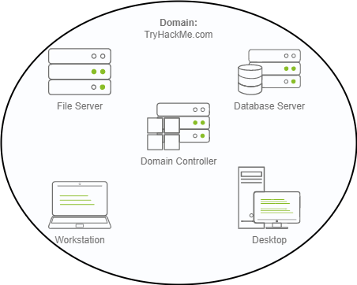

## Windows 基础
### Windows基础 part.1
- GUI
- 文件系统
  - NTFS
    - 在NTFS卷上，可设置文件或文件夹的权限
    - 备用数据流(ADS)
      - 从安全角度来看，恶意软件编写者使用 ADS 来隐藏数据
- system32文件夹

### Windows基础 part.2
- 系统配置 `msconfig`
  - 常规
    - 在“常规”选项卡中，可选择在启动时为 Windows 加载哪些设备和服务。
  - 引导
    - 在引导选项卡中，可为操作系统定义各种引导选项。 
  - 服务
    - 服务选项卡列出了为系统配置的所有服务，无论其状态如何（运行或停止）。服务是在后台运行的一种特殊类型的应用程序。  
  - 启动
    - 使用任务管理器 `taskmgr`管理启动项。
  - 工具
    - 系统实用工具列表
- 工具 —— 更改UAC设置
- 工具 —— 计算机管理
  - 系统工具
    - 任务计划程序
      - 可创建管理计算机将在指定时间自动执行的常见任务
    - 事件查看器
      - 查看系统日志
    - 共享文件夹
    - 性能
    - 设备管理器
  - 存储
    - 磁盘管理
  - 服务和应用程序
    - 服务
    - WMI控件
      - 已弃用,被 powershell 替代
- 工具 —— 系统信息
  - 硬件资源
    - 是可分配的可寻址总线路径，允许外围设备和系统处理器相互通信
  - 组件
    - 可以查看有关计算机上安装的硬件设备的特定信息。有些部分不显示任何信息，但有些部分会显示
  - 软件环境
    - 有关嵌入操作系统的软件和您已安装的软件的信息。此部分中还可以看到其他详细信息，例如环境变量和网络连接
- 工具 —— 资源监视器
- 工具 —— 命令提示符
  - `netstat` 显示协议统计信息和当前 TCP/IP 网络连接
    - `netstat /?` 帮助手册
  - `net` 管理网络资源
    - `net help commands` 帮助手册
- 工具 —— 注册表编辑器
### Windows基础 part.3
- Windows 更新(update)
  - 通常在每个月的第二个星期二
- Windows 安全
  - 病毒和威胁防护
    - 当前威胁
    - “病毒和威胁防护”设置
  - 防火墙与网络保护
  - 应用和浏览器控制
  - 设备安全
- 小结
  - [Living-Off-the-Land Binaries](https://lolbas-project.github.io/)
### Active Directory Basics
- Windows域 (Windows domain)
  - 想象一下您正在管理一个只有五台计算机和五名员工的小型企业网络。在如此小的网络中，您可能能够毫无问题地单独配置每台计算机。您将手动登录每台计算机，为使用它们的人员创建用户，并为每个员工的帐户进行特定配置。如果用户的计算机停止工作，您可能会去他们的地方并现场修复计算机
  - 但让我们假设您的业务突然增长，现在拥有 157 台计算机和分布在四个不同办公室的 320 名不同用户。您是否仍然能够将每台计算机作为单独的实体进行管理，为网络上的每个用户手动配置策略并为每个人提供现场支持？答案很可能是否定的
  - 为了克服这些限制，我们可以使用 Windows 域。简而言之，Windows 域是给定企业管理下的一组用户和计算机
  - 域背后的主要思想是在称为Active Directory (AD)的单个存储库中集中管理 Windows 计算机网络的常见组件
  - 运行 Active Directory 服务的服务器称为域控制器 (DC)

    

  - 优点
    - 集中身份管理：网络上的所有用户都可以轻松地从 Active Directory 进行配置
    - 管理安全策略：可以直接从 Active Directory 配置安全策略，并根据需要将它们应用到网络上的用户和计算机