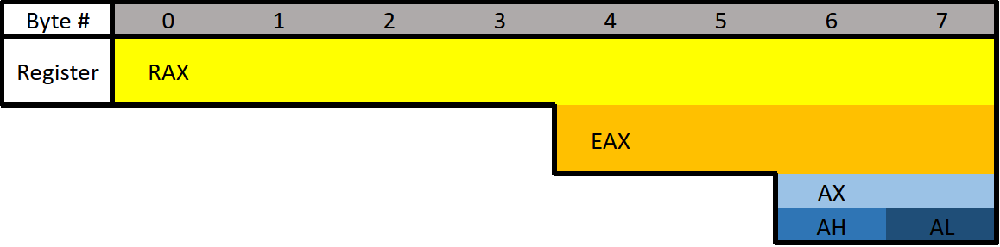

# 逆向工程
### 基础-x64程序集
- 计算机以纯粹的逻辑运作，不做任何假设。
- 数字系统
  - 10 进制
    - 表示 10 进制，通常使用"d"，例如 12d
  - 7 进制
  - 2 进制
    - 表示 2 进制，前缀"0b"，例如 0b01110
    - 也可使用后缀"b"，例如 110b
  - 16 进制
    - 表示 16 进制，通常使用"0x"前缀或后缀"h"，例如 0xFF 或 FFh
  - 前缀和后缀
    - 10进制数字用后缀"d"表示，或者不加后缀。示例：12d 或 12
    - 16进制用前缀“0x”或后缀“h”表示 。示例：0x12 或 12h
      - 16进制的另一种表示方式是使用前缀“\x”。然而，这通常是按字节使用的。两个十六进制数字构成一个字节。示例：\x12 或 \x12\x45\x21
    - 二进制用后缀“b”或 在开头填充零表示。示例：100101b 或 00100101
- 位和字节
  - Bit is one binary digit. Can be 0 or 1.
  - Nibble(半字节) is 4 bits.
  - Byte is 8 bits.
  - Word is 2 bytes.
  - Double Word (DWORD) is 4 bytes. Twice the size of a word.
  - Quad Word (QWORD) is 8 bytes. Four times the size of a word.
  - 数据类型大小
    - Char 1字节，8位
    - Int 16位、32位、64位
    - Bool 1字节，8位（布尔值只需要1位，但它仍然占用一个完整的字节，原因是alignment（对齐）
  - 偏移量(Offsets) 地址偏移
- 二元运算
  - 真/假
    - False 一般使用数值 0 ，Ture 一般使用 非0任意值
  - NOT("!")
    - NOT 1 = 1! = 0
    - NOT 0 = 0! = 1
  - AND("&")
    - 1 AND 1 = 1
    - 1 AND 0 = 0
    - 0 AND 0 = 0
  - OR("|")
    - 1 OR 1 = 1
    - 1 OR 0 = 1
    - 0 OR 0 = 0
  - XOR("^")异或
    - 1 XOR 1 = 0
    - 1 XOR 0 = 1
    - 0 XOR 0 = 0
  - 上述操作还有逆操作，例如 NAND 和 NOR。这些操作执行各自的主要操作，然后在最后执行 NOT。例如，NAND 执行 AND 运算，然后对 AND 运算的结果执行 NOT 运算。
- 寄存器
  - 存在两种不同的汇编语法，Intel和AT&T。
  - 编译(compile)、 代码优化、 **汇编(Assembly)**、 链接 (link)
  
    ```C
    if(x == 4){
        func1();
    }
    else{
        return;
    }
    ```
    ```
    mov RAX, x
    cmp RAX, 4
    jne 5       ; Line 5 (ret)
    call func1
    ret
    ```
  - 寄存器
    - 通用寄存器 General Purpose Registers (GPR)，可以将它们视为变量，因为它们本质上就是这样。 CPU 有自己的存储速度非常快。这固然很棒，但是 CPU 中的空间极其有限。任何太大而无法放入寄存器的数据都会存储在内存 (RAM) 中。与访问寄存器相比，CPU 访问内存要慢得多。由于速度较慢，CPU 尽可能将数据放入寄存器而不是内存中。如果数据太大而无法放入寄存器，寄存器将保存指向该数据的指针，以便可以访问该数据。
    - 8个通用寄存器
      - RAX 累加寄存器，通常用于存储函数的返回值
      - RBX 基址寄存器
      - RCX 计数寄存器，循环操作和字符处理的计数控制
      - RDX 数据寄存器
      - RSI 源指数，用作字符串操作中的源指针
      - RDI 目标索引，用作字符串操作中的目标指针
      - RSP 堆栈指针，保存堆栈顶部的地址
      - RBP 基指针，保存堆栈基址（底部）的地址
        - 所有这些寄存器都用于保存数据。需要立即指出的是，这些寄存器可以用于任何用途。再次强调，它们的“使用”只是常见的做法。
          - 例如，RAX 通常用于保存函数的返回值，但它不是必须的（而且通常也没有）。但是，假设正在用汇编语言编写程序。知道函数的返回值去了哪里将非常有帮助，否则为什么要调用该函数呢？另外，看看我之前给出的 Assembly 示例。它使用 RAX 来存储x变量
        - 话虽如此，在处理典型数据时，最好不要处理某些寄存器。例如，RSP 和 RBP 几乎应始终仅用于其设计用途。它们存储当前堆栈帧的位置（我们很快就会进入堆栈），这非常重要。如果确实使用 RBP 或 RSP，您将需要保存它们的值，以便在完成后将它们恢复到原始状态
    - 指令指针
      - RIP，指令指针寄存器，存储要执行的下一行代码的地址
    - 寄存器故障
      - 每个寄存器可以分为更小的段，可以用其他寄存器名称引用。RAX为64位，低32位可以用EAX引用，低16位可以用AX引用。AX 分为两个 8 位部分。AX的高/高8位可以用AH来引用。低8位可以用AL来引用
        
        - RAX 由全部 8 个字节组成，即字节 0-7。EAX 由字节 4-7 组成，AX 由字节 6-7 组成，AH 仅由字节 6 组成，AL 仅由字节 7（最后一个字节）组成
        - 如果 `0x0123456789ABCDEF` 加载到RAX等64位寄存器中，则RAX指 `0x0123456789ABCDEF` ，EAX指 `0x89ABCDEF` ，AX指 `0xCDEF` ，AH指 `0xCD`，AL指 `0xEF`
    - 不同的数据类型
      - 浮点值 - 浮点数和双精度数
      - 整数值 - 整数、布尔值、字符、指针等
        - 不同的数据类型不能只放入任何寄存器中。浮点值的表示方式与整数不同。因此，浮点值有特殊的寄存器。这些寄存器包括YMM0 至 YMM15（64 位）和XMM0 至 XMM15（32 位）。XMM 寄存器是 YMM 寄存器的下半部分，类似于 EAX 是 RAX 的下 32 位
        - 这些寄存器的独特之处在于它们可以被视为数组。换句话说，它们可以保存多个值。例如，YMM# 寄存器每个都是 256 位宽，可以保存 4 个 64 位值或 8 个 32 位值。同样，XMM# 寄存器为 128 位宽，可以保存 2 个 64 位值或 4 个 32 位值。需要特殊指令才能将这些寄存器用作向量
    - 额外寄存器
      - 这些寄存器没有任何特殊用途。寄存器r8 到 r15设计用于整数类型值（不是浮点数或双精度数）。低4字节（32位）、2字节（16位）、8位（1字节）均可访问。可以通过附加字母“d”、“w”或“b”来访问它们。
      - 例子：
        - R8 - 完整的 64 位（8 字节）寄存器。
        - R8D - 低位双字（4 个字节）。
        - R8W - 低位字（2 个字节）
        - R8B——低字节。
- 指令集
  - 三个术语
    - immediate value (or just immediate, sometimes IM) 类似于数字 12。immediate value 不是内存地址或寄存器，而是某种常量数据
    - 寄存器指的是 RAX、RBX、R12、AL 等
    - 内存或内存地址是指内存中的某个位置（内存地址），例如 0x7FFF842B
  - 基础指令格式
    - `(Instruction/Opcode/Mnemonic) <Destination Operand>, <Source Operand>`
    - e.g. `mov RAX,5` 5 是个 immediate value 
  - 常用指令
    - 数据移动
      - `mov` 将源操作数移动/存储到目标中。源不必是立即值
        - `mov RAX 5`
      - `lea` 加载有效地址的缩写。除了地址之外，其本质上与 `MOV` 相同
      - `MOV` 和 `LEA` 之间的主要区别在于 `LEA` 不会取消引用
        - `lea RAX, num1` RAX 设置为 num1 的地址
        - `lea RAX, [struct+8]` RAX 设置为结构中成员的地址，距结构开头 8 个字节
        - RBX 设置为 5，然后使用 LEA 将 RAX 设置为 RBX + 1。RAX 将是 6
            ```
            mov RBX, 5
            lea RAX, [RBX+1]
            ```
      - `push`
      - `pop`
    - 计算
      - `INC` 例子中 RAX 设置为 8，然后递增。最后RAX的值是 9
          ```
          mov RAX, 8
          inc RAX
          ```
      - `DEC` 例子中，最后RAX的值为 7
          ```
          mov RAX, 8
          dec RAX
          ```
      - `ADD` 将源添加到目标并将结果存储在目标
          ```
          mov RAX, 2
          mov RBX, 3
          add RAX, RBX   ;2 移入 RAX，3 移入 RBX，然后将它们相加。然后将结果 (5) 存储在 RAX 中
          ```
      - `SUB` 减法
          ```
          mov RAX, 5
          mov RBX, 3
          sub RAX, RBX   ;2 移入 RAX，3 移入 RBX，然后将它们相减。然后将结果 (2) 存储在 RAX 中
          ```
      - `MUL` 乘法
        - 由于乘法的数据的大小可能会发生很大变化，因此它们使用两个寄存器的串联来存储结果。结果的上半部分存储在RDX中，下半部分存储在RAX中。操作的总结果是 RDX:RAX，但是，仅引用 RAX 通常就足够了
          ```
          mov RAX, 25
          mov RBX, 5
          mul RBX ; Multiplies RAX (25) with RBX (5)
          ```
          - RDX:RAX 的值是 125 
      - `DIV` 除法
        - 由于除法的数据的大小可能会发生很大变化，因此它们使用两个寄存器的串联来存储结果。结果的上半部分存储在RDX中，下半部分存储在RAX中。操作的总结果是 RDX:RAX，但是，仅引用 RAX 通常就足够了
          ```
          mov RAX, 25
          mov RBX, 5
          div RBX ; Divides RAX (25) with RBX (5)
          ```
          - RDX:RAX 的值是 5
    - 流程控制
      - **RET** 返回的缩写。这会将执行返回到调用当前正在执行的函数（也称为调用者）的函数
        - RAX 的目的之一是保存返回值。 以下示例将 RAX 设置为 10，然后返回。这相当于高级编程语言 `return 10`
        
          ```
          mov RAX, 10 ret
          ```
      - **CMP**比较两个操作数并根据结果设置适当的标志。
        - 以下示例将零标志 (ZF) 设置为 1，这意味着比较结果为 RAX 等于 5

          ```
          mov RAX, 5
          cmp RAX, 5
          ```
      - **JCC** 根据当前设置的标志进行跳转的条件跳转。
        - JCC 不是一条指令，而是一个术语，用于表示包括 JNE、JLE、JNZ 等在内的指令集，这是if语句的汇编版本
          - JNE 如果比较不等于则跳转
          - JLE如果小于等于则跳转
          - JG如果大于则跳转等等
          - 如果 RAX 不等于 5，以下示例将返回。如果等于 5，则将 RBX 设置为 10，然后返回
              ```
              mov RAX, 5
              cmp RAX, 5
              jne 5 ; Jump to line 5 (ret) if not equal.
              mov RBX, 10
              ret
              ```
  - Flipping Out  
    - 编译器注重效率，观察以下示例中编译器生成的代码，发现它更高效并且跳过更多代码
      ```C
      if(x == 4){
        func1();
      }
      else{
        return;
      }

      # 编译结果
      if(x != 4){
        goto __exit;
      }
      func1();
      __exit:
      return;
      ```
  - 指针
    - 在汇编中使用指针和地址时需要了解的两个最重要的事情是 LEA 和 方括号
      - 方括号 
        - **[var]** var的内存地址
        - **LEA** 使用 LEA 时忽略有关方括号的所有内容。LEA 是“加载有效地址”的缩写，用于计算和加载地址
          - **请务必注意，使用 LEA 指令时，方括号不会进行解引用(dereference)** ，以下为示例
            ```
            lea RAX, [var]
            mov [RAX], 12   

            等价于
            mov var, 12

            再次强调，使用 lea 时，[] 不进行解引用
            lea RAX, [RCX+8] ;将 RCX 的地址加 8，然后将结果地址放入 RAX 中
            mov RAX, [RCX+8] ;将 RCX 的地址加 8, 然后解引用(dereference)结果地址，将结果地址中的值(无论是什么)放入 RAX 中
            ```
  - jcc指令集
    - 讨论 **jg**(jump if greater #大于#) 和 **ja** (jump if above #高于#) 等的区别，主要区别是有符号数和无符号数的跳转
      - 对于无符号数(unsigned)
        - JB/JNAE（CF = 1）；如果低于/不高于或等于则跳转
        - JAE/JNB（CF = 0）；如果高于或等于/不低于则跳转
        - JBE/JNA（CF = 1 或 ZF = 1）；如果低于或等于/不高于则跳转
        - JA/JNBE（CF = 0 且 ZF = 0）；如果高于/不低于或等于则跳转
      - 对于有符号数(signed)
        - JL/JNGE (SF <> OF) ; 如果小于/不大于或等于则跳转
        - JGE/JNL (SF = OF) ; 如果大于或等于/不小于则跳转
        - JLE/JNG（ZF = 1 或 SF <> OF）；如果小于或等于/不大于则跳转
        - JG/JNLE（ZF = 0 且 SF = OF）；如果大于/不小于或等于则跳转
    - 通常使用有符号(signed)的数字，我们通常说大于或小于
    - **call** 用于调用函数
    - `<>` 不等号
- 标志(flag)
  - **flag** 用于表示先前执行的操作或比较的结果
  - 状态标志
    - 零标志 (ZF) - 如果运算结果为零则设置。如果运算结果不为零，则不设置
    - 进位标志 (CF) - 如果最后一个无符号算术运算进位（加法）或借用（减法）超出寄存器的位，则设置该标志。如果操作没有未签名，则当操作为负时也会设置它
    - 溢出标志 (OF) - 如果有符号算术运算太大而寄存器无法容纳，则设置
    - 符号标志 (SF) - 如果运算结果为负则设置
    - 调整/辅助标志 (AF) - 与进位标志相同，但用于二进制编码十进制 (BCD) 操作
    - 奇偶校验标志 (PF) - 如果最后 8 位中设置的位数为偶数，则设置为 1。（10110100，PF=1；10110101，PF=0）
    - 陷阱标志 (TF) - 允许单步执行程序
  - 例子
    - 基本比较(零标志位)
      ```
      mov RAX, 4
      cmp RAX, 4
      jne 5       ; Line 5 (ret) 不相等则跳到第5行
      call func1
      ret
      ; ZF = 1, OF = 0, SF = 0
      ```
    - 减法(符号标志位)
      ```
      mov RAX, 2
      sub RAX, 8  ; 2 - 8 = -6.
      ; ZF = 0, OF = 0, SF = 1
      ```
    - 加法(溢出标志位)
      ```
      mov AL, 75
      add AL, 60
      ; ZF = 0, OF = 1, SF = 1
      ```
      - 回顾:符号(signed)二进制
        - 在有符号二进制中，最左边的位是符号位，0表示正数，1表示负数。其余的位则用来表示数值的大小
        - 一个8位有符号二进制数的例子: **11011010**
          - 最左边的位是1，因此这是一个负数。接下来的7位 **1011010** 代表数值部分
          - 要计算这个负数的十进制值，可以使用 **补码** 的概念
            - 首先，将除符号位外的其余位取反（0变1，1变0）得到反码，即 **0100101**
            - 然后，将反码加1，得到补码: **0100110**
            - 最后将补码转化为十进制 38 ，带上负号 -38
      - 